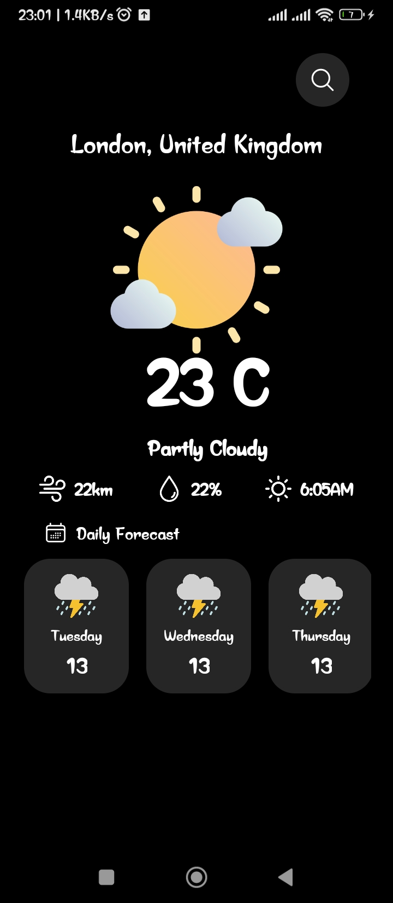
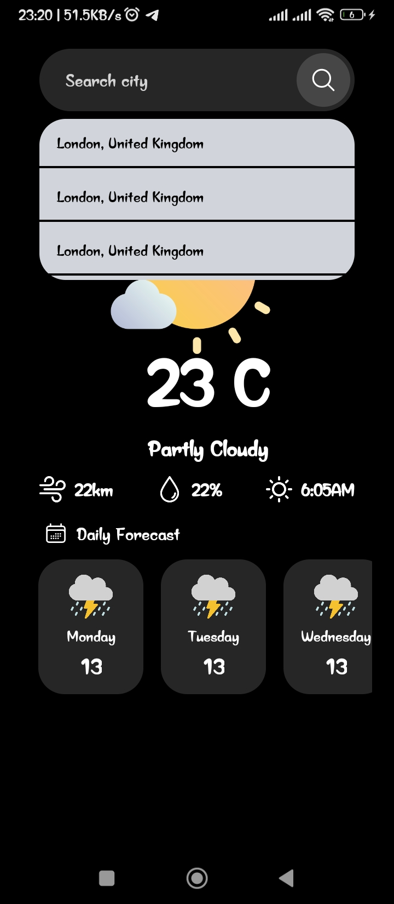

# Weather App - React Native

This React Native mobile app fetches and displays real-time weather data from an external API, providing users with the latest weather conditions for various locations. Users can search for a city to view current weather details, making it an excellent project for learning how to work with APIs and implementing navigation in React Native.

## Features

- Fetches real-time weather data from an external API.
- Displays current weather conditions, including temperature, humidity, and wind speed.
- Allows users to search for weather details by city.
- Smooth and responsive navigation for an intuitive user experience.

## Screenshots

<div style="display: flex;"> 
 
 
</div>

## Technologies Used

- **React Native**: Mobile app development framework
- **Expo**: Tool for building React Native apps
- **JavaScript**: Core programming language used

## Installation

This is an [Expo](https://expo.dev) project created with [`create-expo-app`](https://www.npmjs.com/package/create-expo-app).

1. Clone the repository:

   ```bash
   git clone https://github.com/Chigozie0706/react-native-blog-post.git
   ```

2. Navigate to the current directory

   ```bash
   cd react-native-blog-post
   ```

3. Install dependencies

   ```bash
   pnpm install
   ```

4. Start the app

   ```bash
    pnpm expo start
   ```

In the output, you'll find options to open the app in a

- [development build](https://docs.expo.dev/develop/development-builds/introduction/)
- [Android emulator](https://docs.expo.dev/workflow/android-studio-emulator/)
- [iOS simulator](https://docs.expo.dev/workflow/ios-simulator/)
- [Expo Go](https://expo.dev/go), a limited sandbox for trying out app development with Expo

You can start developing by editing the files inside the **app** directory. This project uses [file-based routing](https://docs.expo.dev/router/introduction).

## Learn more

To learn more about developing your project with Expo, look at the following resources:

- [Expo documentation](https://docs.expo.dev/): Learn fundamentals, or go into advanced topics with our [guides](https://docs.expo.dev/guides).
- [Learn Expo tutorial](https://docs.expo.dev/tutorial/introduction/): Follow a step-by-step tutorial where you'll create a project that runs on Android, iOS, and the web.

## Join the community

Join our community of developers creating universal apps.

- [Expo on GitHub](https://github.com/expo/expo): View our open source platform and contribute.
- [Discord community](https://chat.expo.dev): Chat with Expo users and ask questions.
